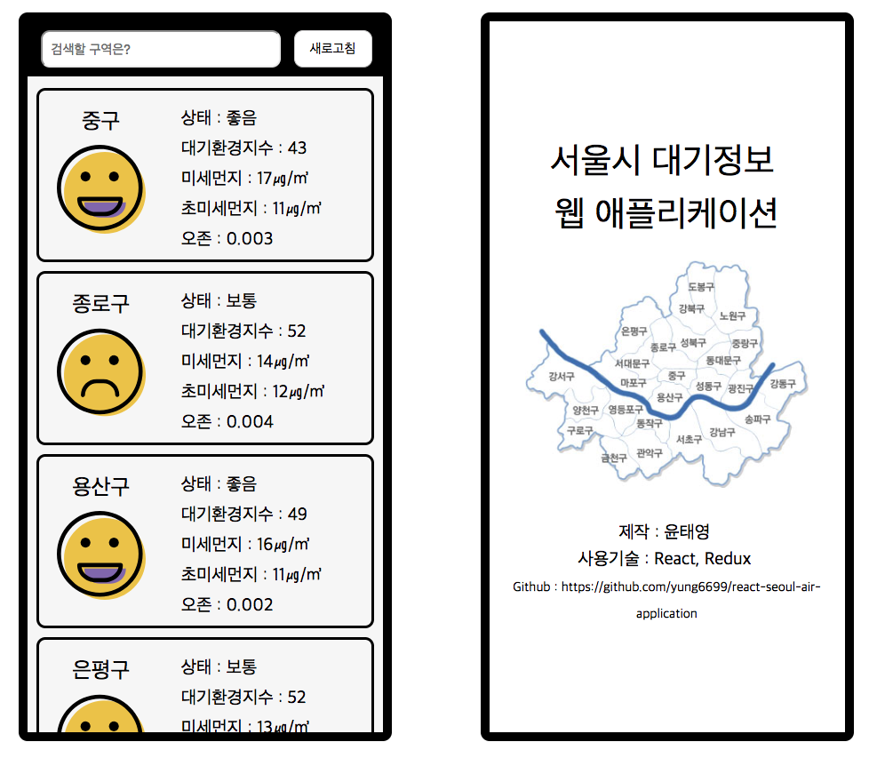

# React Seoul Air

서울시 공공데이터 (대기 상태)를 활용한 간단한 공기 상태 확인 애플리케이션  

\* 강남 리액트 스터디 첫 번째 미니 프로젝트

## 사용기술

- React
- Redux
- Axios
- Monent.js

## 특이사항

- .env 설정에 어려움을 겪음
- 데이터 필터링을 통한 검색 기능 추가

## 이미지

